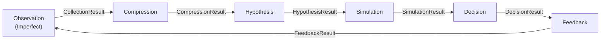

# Universal Gear

*[Leia em Portugues](README.pt-BR.md)*

[](https://github.com/bruno-portfolio/Universal-Gear/actions/workflows/ci.yml)
[](https://pypi.org/project/universal-gear/)
[](https://pypi.org/project/universal-gear/)
[](LICENSE)

**Open-source Python decision framework for market intelligence under uncertainty.**



## Quick Start

```bash
pip install -e .
ugear run toy
```

```
┌──────── Universal Gear - toy pipeline ────────┐
│ OK  Observation  90 events │ reliability: 0.93 │
│ OK  Compression  13 states │ weekly            │
│ OK  Hypothesis   1 hypotheses                  │
│ OK  Simulation   baseline + 10 scenarios       │
│ OK  Decision     9 decisions │ alert            │
│ OK  Feedback     9 scorecards │ hit_rate: 1.00  │
└────── SUCCESS - total: 0.0s ──────────────────┘
```

## Who Is This For

1. **Developers building decision pipelines** -- Wire up the six-stage loop with async stages, Pydantic v2 contracts, and structlog observability. Swap any stage without touching the rest.

2. **Data scientists exploring market signals** -- Run `ugear run toy` for a synthetic sandbox or `ugear run agro` against real Brazilian agricultural data via agrobr. Inspect every intermediate result through typed contracts.

3. **Domain experts adding plugins for specific markets** -- Register custom collectors, compressors, or simulators with decorators (`@register_collector`, etc.) or via `entry_points`. No framework internals required.

## Pipelines

| Pipeline | Data Source | Use Case |
|----------|-------------|----------|
| `toy` | Synthetic (offline) | Learning, testing, CI |
| `agro` | Real Brazilian agricultural data (agrobr) | Production market intelligence |

## Key Features

- **6-stage feedback loop** -- Observation, Compression, Hypothesis, Simulation, Decision, Feedback
- **Pydantic v2 contracts** -- Every stage boundary is a typed, validated result object
- **Async pipeline** -- Stages run asynchronously for I/O-heavy collectors
- **Plugin system** -- Decorators (`@register_collector`, `@register_compressor`, ...) and setuptools `entry_points`
- **structlog observability** -- Structured logging across the full pipeline
- **118 tests passing** -- Comprehensive coverage across all stages

## Documentation

- [MANIFESTO.md](MANIFESTO.md) -- Design philosophy and architectural rationale
- [docs/](docs/) -- Full documentation

## License

MIT
