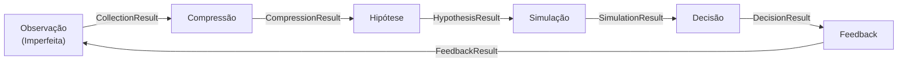

# Universal Gear

*[Read in English](README.md)*

[](.)
[](.)
[](LICENSE)

**Framework open-source em Python para inteligência de mercado sob incerteza.**



## Início Rápido

```bash
pip install -e .
ugear run toy
```

```
┌──────── Universal Gear - toy pipeline ────────┐
│ OK  Observation  90 events │ reliability: 0.93 │
│ OK  Compression  13 states │ weekly            │
│ OK  Hypothesis   1 hypotheses                  │
│ OK  Simulation   baseline + 10 scenarios       │
│ OK  Decision     9 decisions │ alert            │
│ OK  Feedback     9 scorecards │ hit_rate: 1.00  │
└────── SUCCESS - total: 0.0s ──────────────────┘
```

## Para Quem É

1. **Desenvolvedores construindo pipelines de decisão** -- Monte o loop de seis estágios com stages assíncronos, contratos Pydantic v2 e observabilidade via structlog. Troque qualquer estágio sem tocar no resto.

2. **Cientistas de dados explorando sinais de mercado** -- Execute `ugear run toy` para um sandbox sintético ou `ugear run agro` contra dados reais do agronegócio brasileiro via agrobr. Inspecione cada resultado intermediário através de contratos tipados.

3. **Especialistas de domínio adicionando plugins para mercados específicos** -- Registre coletores, compressores ou simuladores customizados com decorators (`@register_collector`, etc.) ou via `entry_points`. Sem necessidade de mexer nos internos do framework.

## Pipelines

| Pipeline | Fonte de Dados | Caso de Uso |
|----------|----------------|-------------|
| `toy` | Sintético (offline) | Aprendizado, testes, CI |
| `agro` | Dados reais do agronegócio brasileiro (agrobr) | Inteligência de mercado em produção |

## Funcionalidades

- **Loop de feedback em 6 estágios** -- Observação, Compressão, Hipótese, Simulação, Decisão, Feedback
- **Contratos Pydantic v2** -- Toda fronteira entre estágios é um objeto de resultado tipado e validado
- **Pipeline assíncrono** -- Estágios rodam de forma assíncrona para coletores com I/O pesado
- **Sistema de plugins** -- Decorators (`@register_collector`, `@register_compressor`, ...) e setuptools `entry_points`
- **Observabilidade via structlog** -- Logging estruturado em todo o pipeline
- **118 testes passando** -- Cobertura abrangente em todos os estágios

## Documentação

- [MANIFESTO.md](MANIFESTO.pt-BR.md) -- Filosofia de design e fundamentos arquiteturais
- [docs/](docs/) -- Documentação completa

## Licença

MIT
