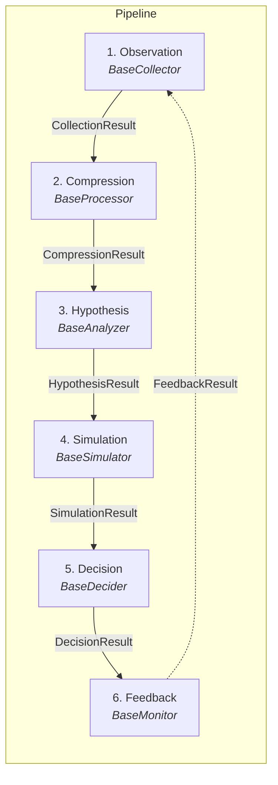

# Universal Gear -- Architecture

Universal Gear is an open-source Python decision framework for market intelligence under uncertainty. It models a six-stage pipeline that transforms raw market observations into actionable decisions and continuously improves through a feedback loop.

---

## Component Diagram



The dashed arrow from **Feedback** back to **Observation** represents the feedback loop: scorecards produced by the monitor stage inform subsequent collection cycles, enabling the pipeline to adapt over time.

---

## Architectural Decisions

### DA-01: Package Naming

| Aspect  | Value                                      |
|---------|--------------------------------------------|
| Package | `universal_gear`                           |
| Repo    | `universal-gear`                           |
| Import  | `from universal_gear import Pipeline, stages` |
| CLI     | `ugear`                                    |

The Python package follows PEP 8 underscore convention (`universal_gear`), while the repository uses the kebab-case convention common on GitHub (`universal-gear`). The CLI entry point is a short alias (`ugear`) for ergonomic shell usage.

---

### DA-02: Plugin System -- Strategy Pattern + Entry Points

Each pipeline stage defines an abstract interface (ABC). Concrete implementations are registerable plugins discovered at runtime.

**Built-in registration** uses a decorator:

```python
@register_collector("name")
class MyCollector(BaseCollector):
    async def collect(self) -> CollectionResult:
        ...
```

**External registration** uses standard Python entry points:

```toml
[project.entry-points."universal_gear.collectors"]
my_collector = "my_package.collectors:MyCollector"
```

This pattern applies uniformly to all six stage types (`collectors`, `processors`, `analyzers`, `simulators`, `deciders`, `monitors`), giving third-party packages first-class extensibility without modifying Universal Gear itself.

---

### DA-03: Pipeline Orchestration

The `Pipeline` object receives one concrete plugin per stage. It passes the typed output of each stage as input to the next, validating the contracts between stages at runtime.

```python
from universal_gear import Pipeline

pipeline = Pipeline(
    collector=...,
    processor=...,
    analyzer=...,
    model=...,
    action=...,
    monitor=...,
)

await pipeline.run()
```

Contract validation ensures that, for example, a `BaseProcessor.process()` call always receives a `CollectionResult` and always returns a `CompressionResult`. A mismatch raises a clear error before data reaches the next stage.

---

### DA-04: Async by Default

All stage interfaces are defined as `async def` methods for uniformity, even when a particular implementation is CPU-bound.

- **Collectors** use `async def collect()` with `httpx` as the default HTTP client.
- **All other stages** follow the same `async def` signature convention.
- **Pipeline runner** is invoked via `asyncio.run(pipeline.run())` at the top level (or awaited directly when already inside an async context).

This decision avoids a split between sync and async APIs, keeps the mental model simple, and allows I/O-heavy collectors and simulators to run concurrently when the pipeline supports it in the future.

---

### DA-05: Observability

Structured observability is built in from the start, without requiring heavy external dependencies.

| Concern             | Implementation                                                                 |
|---------------------|--------------------------------------------------------------------------------|
| Structured logging  | `structlog` -- JSON output in production, pretty-printed output in development |
| Stage events        | Each stage emits typed events: `stage.started`, `stage.completed`, `stage.failed` |
| Internal metrics    | `StageMetrics` dataclass per execution (duration, success flag)                |
| External telemetry  | No Prometheus or OpenTelemetry dependency; the internal structure allows a future adapter |

The `StageMetrics` dataclass captures timing and outcome data for every stage run, making it straightforward to add an export adapter (Prometheus, OpenTelemetry, Datadog) later without changing stage code.

---

### DA-06: Configuration

Configuration is handled at two levels:

1. **Global config** -- `Pydantic BaseSettings` reads from environment variables and `.env` files.
2. **Plugin config** -- Each plugin defines its own `Config(BaseModel)` with plugin-specific fields and validation.

A declarative `pipeline.yaml` format is planned for a future release (post-MVP) to allow pipelines to be defined without writing Python code.

```yaml
# Future -- not part of MVP
pipeline:
  collector: rss
  processor: default
  analyzer: bayesian
  model: monte_carlo
  action: threshold
  monitor: basic
```

---

## Data Flow Between Stages

The pipeline is a strict linear chain with a feedback loop. Each stage consumes exactly one typed result and produces exactly one typed result.

```
 CollectionResult    CompressionResult   HypothesisResult   SimulationResult    DecisionResult     FeedbackResult
       |                   |                   |                  |                  |                  |
  [Observation] -----> [Compression] -----> [Hypothesis] -----> [Simulation] -----> [Decision] -----> [Feedback]
       ^                                                                                                 |
       |_________________________________________________________________________________________________|
                                              FeedbackResult (loop)
```

### Stage Interfaces (ABCs)

| #  | Stage        | ABC              | Method       | Input               | Output              |
|----|------------- |------------------|--------------|----------------------|----------------------|
| 1  | Observation  | `BaseCollector`  | `collect()`  | --                   | `CollectionResult`   |
| 2  | Compression  | `BaseProcessor`  | `process()`  | `CollectionResult`   | `CompressionResult`  |
| 3  | Hypothesis   | `BaseAnalyzer`   | `analyze()`  | `CompressionResult`  | `HypothesisResult`   |
| 4  | Simulation   | `BaseSimulator`  | `simulate()` | `HypothesisResult`   | `SimulationResult`   |
| 5  | Decision     | `BaseDecider`    | `decide()`   | `SimulationResult`   | `DecisionResult`     |
| 6  | Feedback     | `BaseMonitor`    | `evaluate()` | `DecisionResult`     | `FeedbackResult`     |

### Contract Details

- **CollectionResult** -- Contains raw events gathered from data sources plus a quality report (completeness, freshness, source reliability).
- **CompressionResult** -- A list of `MarketState` objects that distill the raw events into a structured, queryable representation.
- **HypothesisResult** -- A set of testable hypotheses derived from the compressed market states, each with a prior probability.
- **SimulationResult** -- Simulated scenarios plus a baseline, quantifying the range of possible outcomes for each hypothesis.
- **DecisionResult** -- A list of `DecisionObject` instances, each representing a concrete action recommendation with confidence and risk metadata.
- **FeedbackResult** -- Scorecards that evaluate past decisions against actual outcomes, feeding learning back into the next observation cycle.
