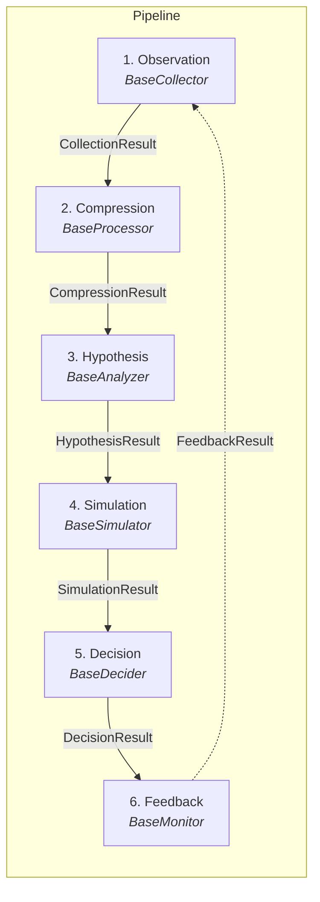

# Universal Gear -- Arquitetura

*[Read in English](architecture.md)*

Universal Gear é um framework de decisão open-source em Python para inteligência de mercado sob incerteza. Ele modela um pipeline de seis estágios que transforma observações brutas de mercado em decisões acionáveis e melhora continuamente por meio de um ciclo de feedback.

---

## Diagrama de Componentes



A seta tracejada de **Feedback** de volta para **Observation** representa o ciclo de feedback: os scorecards produzidos pelo estágio de monitoramento informam os ciclos de coleta subsequentes, permitindo que o pipeline se adapte ao longo do tempo.

---

## Decisões Arquiteturais

### DA-01: Nomenclatura do Pacote

| Aspecto | Valor                                      |
|---------|--------------------------------------------|
| Package | `universal_gear`                           |
| Repo    | `universal-gear`                           |
| Import  | `from universal_gear import Pipeline, stages` |
| CLI     | `ugear`                                    |

O pacote Python segue a convenção PEP 8 com underscores (`universal_gear`), enquanto o repositório utiliza a convenção kebab-case comum no GitHub (`universal-gear`). O ponto de entrada CLI é um alias curto (`ugear`) para uso ergonômico no terminal.

---

### DA-02: Sistema de Plugins -- Strategy Pattern + Entry Points

Cada estágio do pipeline define uma interface abstrata (ABC). Implementações concretas são plugins registráveis descobertos em tempo de execução.

**Registro interno** utiliza um decorador:

```python
@register_collector("name")
class MyCollector(BaseCollector):
    async def collect(self) -> CollectionResult:
        ...
```

**Registro externo** utiliza entry points padrão do Python:

```toml
[project.entry-points."universal_gear.collectors"]
my_collector = "my_package.collectors:MyCollector"
```

Esse padrão se aplica uniformemente a todos os seis tipos de estágio (`collectors`, `processors`, `analyzers`, `simulators`, `deciders`, `monitors`), proporcionando extensibilidade de primeira classe a pacotes de terceiros sem modificar o Universal Gear em si.

---

### DA-03: Orquestração do Pipeline

O objeto `Pipeline` recebe um plugin concreto por estágio. Ele passa a saída tipada de cada estágio como entrada para o próximo, validando os contratos entre estágios em tempo de execução.

```python
from universal_gear import Pipeline

pipeline = Pipeline(
    collector=...,
    processor=...,
    analyzer=...,
    model=...,
    action=...,
    monitor=...,
)

await pipeline.run()
```

A validação de contratos garante que, por exemplo, uma chamada a `BaseProcessor.process()` sempre receba um `CollectionResult` e sempre retorne um `CompressionResult`. Uma incompatibilidade gera um erro claro antes que os dados alcancem o próximo estágio.

---

### DA-04: Assíncrono por Padrão

Todas as interfaces de estágio são definidas como métodos `async def` por uniformidade, mesmo quando uma implementação específica é limitada por CPU.

- **Collectors** utilizam `async def collect()` com `httpx` como cliente HTTP padrão.
- **Todos os outros estágios** seguem a mesma convenção de assinatura `async def`.
- **O executor do pipeline** é invocado via `asyncio.run(pipeline.run())` no nível superior (ou aguardado diretamente quando já está dentro de um contexto assíncrono).

Essa decisão evita uma divisão entre APIs síncronas e assíncronas, mantém o modelo mental simples e permite que collectors e simuladores com uso intensivo de I/O sejam executados concorrentemente quando o pipeline suportar isso no futuro.

---

### DA-05: Observabilidade

A observabilidade estruturada é integrada desde o início, sem exigir dependências externas pesadas.

| Aspecto             | Implementação                                                                  |
|---------------------|--------------------------------------------------------------------------------|
| Logging estruturado | `structlog` -- saída JSON em produção, saída formatada em desenvolvimento      |
| Eventos de estágio  | Cada estágio emite eventos tipados: `stage.started`, `stage.completed`, `stage.failed` |
| Métricas internas   | Dataclass `StageMetrics` por execução (duração, flag de sucesso)               |
| Telemetria externa  | Sem dependência de Prometheus ou OpenTelemetry; a estrutura interna permite um adaptador futuro |

A dataclass `StageMetrics` captura dados de temporização e resultado para cada execução de estágio, tornando simples adicionar um adaptador de exportação (Prometheus, OpenTelemetry, Datadog) posteriormente sem alterar o código dos estágios.

---

### DA-06: Configuração

A configuração é tratada em dois níveis:

1. **Configuração global** -- `Pydantic BaseSettings` lê variáveis de ambiente e arquivos `.env`.
2. **Configuração de plugin** -- Cada plugin define seu próprio `Config(BaseModel)` com campos e validação específicos do plugin.

Um formato declarativo `pipeline.yaml` está planejado para uma versão futura (pós-MVP) para permitir que pipelines sejam definidos sem escrever código Python.

```yaml
# Futuro -- não faz parte do MVP
pipeline:
  collector: rss
  processor: default
  analyzer: bayesian
  model: monte_carlo
  action: threshold
  monitor: basic
```

---

## Fluxo de Dados Entre Estágios

O pipeline é uma cadeia linear estrita com um ciclo de feedback. Cada estágio consome exatamente um resultado tipado e produz exatamente um resultado tipado.

```
 CollectionResult    CompressionResult   HypothesisResult   SimulationResult    DecisionResult     FeedbackResult
       |                   |                   |                  |                  |                  |
  [Observation] -----> [Compression] -----> [Hypothesis] -----> [Simulation] -----> [Decision] -----> [Feedback]
       ^                                                                                                 |
       |_________________________________________________________________________________________________|
                                              FeedbackResult (loop)
```

### Interfaces dos Estágios (ABCs)

| #  | Estágio      | ABC              | Método       | Entrada              | Saída                |
|----|------------- |------------------|--------------|----------------------|----------------------|
| 1  | Observation  | `BaseCollector`  | `collect()`  | --                   | `CollectionResult`   |
| 2  | Compression  | `BaseProcessor`  | `process()`  | `CollectionResult`   | `CompressionResult`  |
| 3  | Hypothesis   | `BaseAnalyzer`   | `analyze()`  | `CompressionResult`  | `HypothesisResult`   |
| 4  | Simulation   | `BaseSimulator`  | `simulate()` | `HypothesisResult`   | `SimulationResult`   |
| 5  | Decision     | `BaseDecider`    | `decide()`   | `SimulationResult`   | `DecisionResult`     |
| 6  | Feedback     | `BaseMonitor`    | `evaluate()` | `DecisionResult`     | `FeedbackResult`     |

### Detalhes dos Contratos

- **CollectionResult** -- Contém eventos brutos coletados de fontes de dados, além de um relatório de qualidade (completude, atualidade, confiabilidade da fonte).
- **CompressionResult** -- Uma lista de objetos `MarketState` que destilam os eventos brutos em uma representação estruturada e consultável.
- **HypothesisResult** -- Um conjunto de hipóteses testáveis derivadas dos estados de mercado comprimidos, cada uma com uma probabilidade a priori.
- **SimulationResult** -- Cenários simulados mais uma linha de base, quantificando a faixa de resultados possíveis para cada hipótese.
- **DecisionResult** -- Uma lista de instâncias de `DecisionObject`, cada uma representando uma recomendação de ação concreta com metadados de confiança e risco.
- **FeedbackResult** -- Scorecards que avaliam decisões passadas em relação aos resultados reais, realimentando o aprendizado no próximo ciclo de observação.
